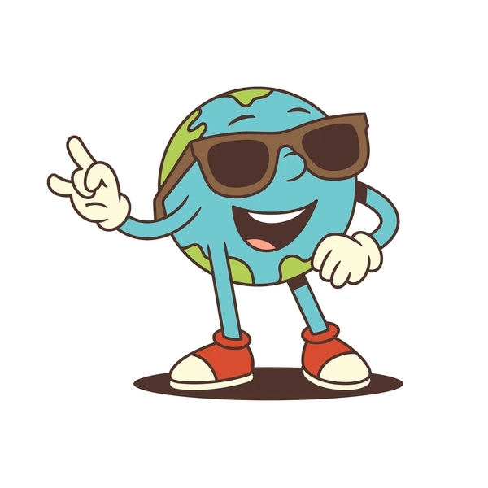
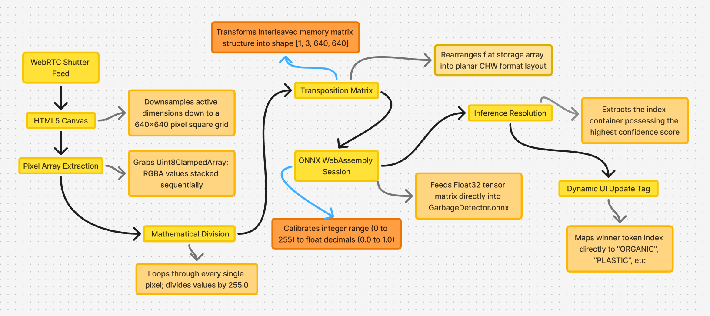
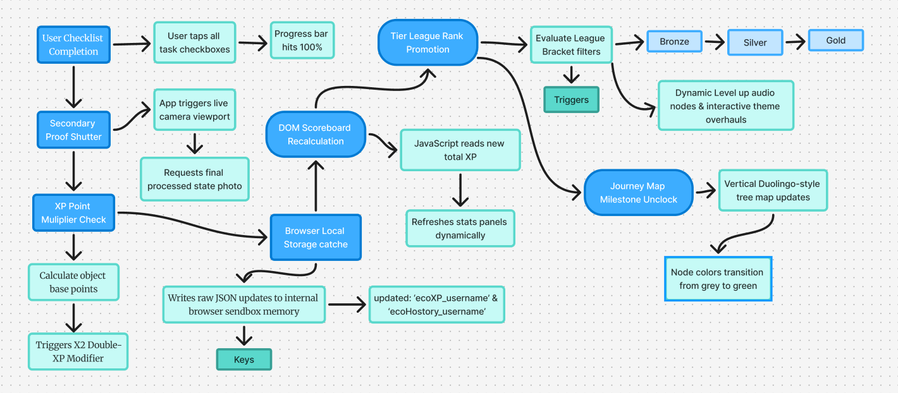

# EcoLens Pro

<p align="center">
  
</p>

<p align="center">
  <b>A Decentralized Edge-AI Computer Vision Ecosystem for Localized Municipal Solid Waste Management & Behavioral Gamification</b>
</p>

<p align="center">
  <a href="#"></a>
  <a href="#"></a>
  <a href="#"></a>
  <a href="#"></a>
</p>

---

## 📖 Executive Summary
Traditional smart recycling frameworks rely heavily on centralized cloud compute servers, introducing high API network latency, continuous data overhead costs, and persistent privacy barriers. 

**EcoLens Pro** introduces a decentralized architectural paradigm. Engineered explicitly for student communities and smart campus deployment, it utilizes an optimized, fine-tuned **YOLOv8-Nano** deep neural network model compiled directly into an **ONNX binary**. By performing high-speed tensor calculations locally inside the web browser's viewport execution pipeline via WebAssembly, EcoLens processes complex object classification loops completely client-side with absolute zero server latency.

---

## 🛠️ Detailed Technical Architecture

### 🧠 1. Real-Time Computer Vision Pipeline
* **Dataset & Augmentation:** Fine-tuned utilizing a balanced imagery collection targeting regional municipal recycling materials (clear plastics, fiber papers, green yard organics, glass anomalies, and composite cardboard).
* **Cloud Compilation Loop:** Trained on an enterprise cloud-hosted **Tesla T4 GPU** infrastructure inside Google Colab over 30 full back-propagation neural optimization cycles (`epochs=30`).
* **Half-Precision Optimization:** Exported and compiled into an optimized **ONNX (Open Neural Network Exchange)** runtime structure with FP16 half-precision quantization calibration. This compressed the heavy deep learning network into an ultra-compact **5.9 MB binary tensor matrix**.
* **Client-Side Image Preprocessing:** The application captures raw data frames from the hardware camera feed via WebRTC, binds them to an HTML5 `<canvas>`, downsamples the coordinates to a strict $640 \times 640$ grid, standardizes pixel values (dividing by `255.0`), and builds a flat **Planar CHW (Channel, Height, Width) format array `[1, 3, 640, 640]`** to push straight into the local engine memory block.

### 🕹️ 2. High-Fidelity Behavioral Gamification Engine
To foster long-term recycling compliance and sustained user engagement, EcoLens features a responsive interface heavily inspired by modern gamified educational architectures:
* **Tactile Validation Checklist:** Real-time generation of micro-quest steps based on AI class resolution, utilizing an interactive DOM verification layer that syncs with dynamic acoustic feedback nodes.
* **Persistent Cache Multi-User Sync:** Uses HTML5 LocalStorage configurations to store unique encrypted profile datasets (`ecoXP_username` & `ecoHistory_username`), maintaining cross-session persistence for multiple users on a single machine.
* **Trophy Leagues Map Engine:** Features an interactive vertical milestone campaign roadmap that calculates cumulative user XP to assign competitive tier ranks (Bronze 🥉 $\rightarrow$ Silver 🥈 $\rightarrow$ Gold 🥇 $\rightarrow$ Diamond 💎 Leagues) with matching dynamic CSS UI style overhauls.
* **Native Multilingual Dictionaries:** Built-in localized translation matrix arrays handling instant interface hot-swapping across English, Bengali, and Hindi tracking loops without reloading the viewport.

---

## 🎨 Visual User Journey Map & Design System

<p align="center">
  
  <br />
  <em>Figure 1: Unified High-Fidelity UI/UX Layout Board delivered by Anisha.</em>
</p>

---

## 📊 Client-Side Technical Architecture Framework

> **System Architecture & Flowcharts Designed by:** Koyel (Technical Systems Designer)

### 🧠 Diagram 1: Client-Side AI Tensor Pipeline
This diagram tracks the end-to-end mathematical transformation of a raw browser camera frame into a multi-dimensional array tensor layer sequence running locally via WebAssembly runtime environments.

<p align="center">
  
  <br />
  <em>Figure 2: Raw frame downsampling, mathematical normalization, matrix transposition, and ONNX WebAssembly session evaluation routing loop designed by Koyel.</em>
</p>

### 🕹️ Diagram 2: Gamified State Persistence Sync Loop
The application operates entirely on the client side without an external backend. The flowchart below maps how user achievements, task completions, and XP tracking synchronize directly with the device's internal browser cache interface.

<p align="center">
  
  <br />
  <em>Figure 3: Client-side gamification pipeline and LocalStorage synchronization map designed by Koyel.</em>
</p>

---

## 📂 System Directory Structure
```text
EcoLensProjectRoot/
├── index.html                   # Core Entry Window (Unified Semantic Layout & Translation Matrix)
├── README.md                    # Project Documentation Registry
├── models/
│   └── custom-yolo/
│       └── GarbageDetector.onnx # Fine-Tuned 5.9MB Quantized Tensor Weight Binary
├── assets/
│   ├── audio/
│   │   ├── Success.mp3          # Checkpoint Validation Acoustic Node
│   │   └── Levelup.mp3          # Milestone League Elevation Audio Hook
│   └── images/
│       └── Mascot.webp          # EcoLens Main Engagement Guide Graphic
└── design/
    ├── user_journey_flow.png    # High-Fidelity 4-Screen User Journey Flowchart
    └── ui_component_library.png # Figma Modular Global UI Component Library
```
---

## 🚀 Installation & Local Deployment Setup

To initiate the edge-native AI runtime locally:

1. Clone or download this project directory workspace setup folder to your computer hardware.

2. Verify that your fine-tuned weights file sits precisely at: models/custom-yolo/GarbageDetector.onnx.

3. Open the directory workspace using VS Code, and launch the Go Live server extension on the bottom status bar (http://127.0.0.1:5500).

4. Input your profile name into the authentication gate modal window, approve device camera stream clearance, and press F12 to open the developer console to track the live tensor matrix execution parameters.

---

## 👥 Project Contribution Ledger

#### Kazi Mustafijur Rahaman — Project Lead / Full-Stack Core Software Development & AI Pipeline Automation

Automated the cloud-hosted Google Colab dataset formatting and neural training sequence (Tesla T4 Cloud GPU layout).

Programmed the custom browser-side tensor array transformer, FP16 matrix mapping loop, and ort.InferenceSession initialization.

Designed and coded the persistent multi-user account state tracking rules, native multi-language dictionaries, and responsive dashboard layouts.

#### Anisha Aktar — UI/UX Strategy & High-Fidelity Graphic Design (Designer 1)

Modeled the gamified design tokens, custom level tree maps, branding color palette arrays, and the modular 4-screen user journey framework in Figma.

#### Koyel Basu — System Logic Architecture & Technical Flowcharts (Designer 2)

Blueprinted the technical architecture diagrams mapping the image pixel processing steps, downsampling canvas workflows, and the local storage cache cycles.

---

<h2 align="center">🌍 Small Actions. Smarter AI. Cleaner Future.</h2>

<p align="center">
  ⭐ If you like this project, consider giving it a star – it helps support and grow EcoLens Pro.
  <br /><br />
  Made with 💖 for sustainability, innovation, and a greener tomorrow.
</p>
